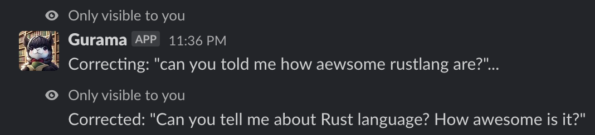

# gurama
A cute llama 🦙 that helps you correct English grammar 📖.
<p align="center">
  
</p>

## Live demo
### Slack command

Note: Currently, there is no publicly available `gurama` Slack app 🙈. The above image is a screenshot of my personal workspace 🤫.

### API
Send request to [HuggingFace space](https://huggingface.co/spaces/metalwhale/gurama):
```bash
curl -H "Content-Type: application/json" -X POST https://metalwhale-gurama.hf.space/correct -d '{"sentence":"Is you okay?"}'
```
or to [m-cloud](https://m-cloud.dev/):
```bash
curl -H "Content-Type: application/json" -X POST https://wave.m-cloud.dev/gurama/correct -d '{"sentence":"Is you okay?"}'
```
Note: It takes approximately 30 seconds to generate a sentence containing 50 words 😱.

## Development
1. Download [`openbuddy-openllama-7b-v5-q4_0.bin`](https://huggingface.co/metalwhale/openbuddy-openllama-7b-v5-q4_0/blob/main/openbuddy-openllama-7b-v5-q4_0.bin) file and put it into [`./model`](./model/) directory
2. Get inside the container:
    ```bash
    cd ./infra-dev
    docker-compose up -d
    docker-compose exec -it app bash
    ```
3. Start the server:
    ```bash
    cd gurama/
    cargo run --release
    ```
4. Testing:
    ```bash
    curl -H "Content-Type: application/json" -X POST http://localhost:7860/correct -d '{"sentence":"Is you okay?"}'
    ```
    ```bash
    {"corrected_sentence":"\"Are you all right?\"."}
    ```

## Release build
```
cd infra-release/
docker build -f Dockerfile -t gurama ../
docker run --rm -p 7860:7860 -e GURAMA_APP_PORT=7860 gurama
```
Or you can also refer to this pre-built image: [`metalwhaledev/gurama`](https://hub.docker.com/r/metalwhaledev/gurama)

## Roadmap
- [ ] Cross-platform build
- [ ] Handle case of many incoming requests
- [ ] Try with smaller models

## Kudos
- [OpenBuddy - Open Multilingual Chatbot](https://huggingface.co/OpenBuddy/openbuddy-openllama-7b-v5-fp16)
- [llama.cpp](https://github.com/ggerganov/llama.cpp)
- [Large Language Models for Everyone, in Rust](https://github.com/rustformers/llm)
- The [icon](./docs/icon.jpg) was generated on https://dreamlike.art using `Dreamlike Anime 1.0` model
